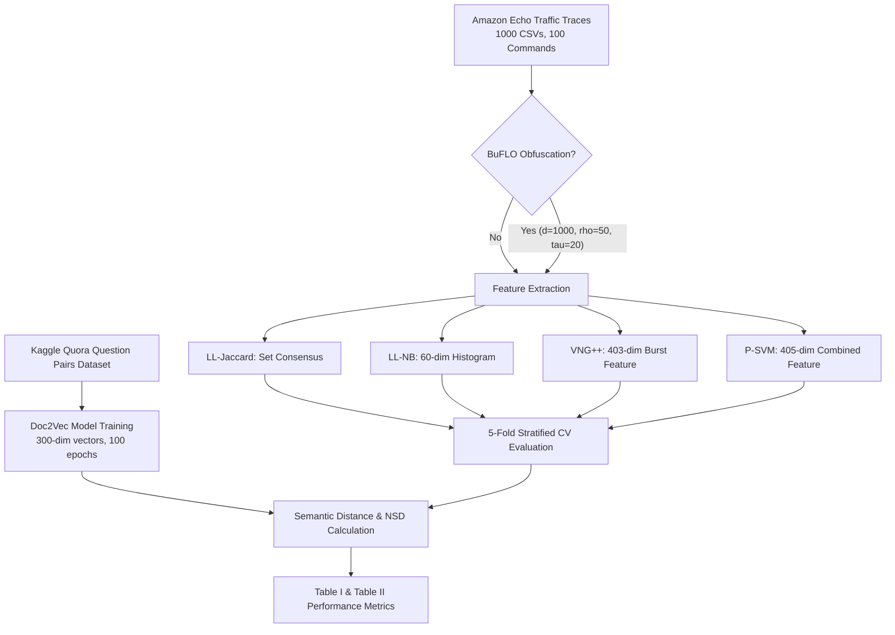

# Voice Command Fingerprinting Attack — Implementation & Replication Report

This document provides a comprehensive technical overview and replication analysis of the Jupyter notebook [`VoiceFingerprintingAttack.ipynb`](file:///c:/Users/Ms%20Bithi/Desktop/Ms_Bithi_RA_Assisgment/VoiceFingerprintingAttack.ipynb). The notebook implements, evaluates, and validates traffic analysis attacks against encrypted smart speaker traffic (Amazon Echo), replicating and expanding upon the baseline research by **Kennedy et al. (2019)** and countermeasure analysis by **Dyer et al. (2012)**.

---

## 📌 Executive Summary

- **Domain**: Encrypted Traffic Analysis & Voice Assistant Privacy.
- **Dataset**: 1,000 encrypted traffic traces spanning 100 distinct voice commands captured from an Amazon Echo device (10 traces/command).
- **Semantic Representation Model**: Doc2Vec ($d=300$) trained on **808,699 Quora questions** from Kaggle to measure semantic similarity/distance between predicted and ground-truth voice commands.
- **Attacks Evaluated**: 
  1. `LL-Jaccard` (Set-based consensus matching)
  2. `LL-NB` (Naive Bayes on packet-size histograms)
  3. `VNG++` (Naive Bayes on packet burst distributions)
  4. `P-SVM (AdaBoost)` (AdaBoost with Decision Trees on high-dimensional traffic features)
- **Countermeasure Evaluated**: BuFLO (Buffered Fixed-Length Messages) obfuscation.
- **Validation**: 5-Fold Stratified Cross-Validation evaluating Accuracy, Semantic Distance (SD), and Normalized Semantic Distance (NSD).

---

## 🏗️ Architecture & Pipeline Workflow

---

## ⚙️ Model & Feature Extraction Technical Details

### 1. Doc2Vec Semantic Embedding
- **Training Source**: Quora Question Pairs Dataset (`questions.csv`, 808,699 questions).
- **Hyperparameters**:
  - `vector_size`: 300
  - `window`: 15
  - `epochs`: 100
  - `dm`: 0 (Distributed Bag of Words - DBOW)
  - `dbow_words`: 1
  - `sample`: $10^{-5}$
  - `negative`: 5
- **Semantic Sanity Check**:
  - `weather` vs `weather tomorrow` $\rightarrow$ Cosine Similarity $\approx 0.801$
  - `weather` vs `set a timer` $\rightarrow$ Cosine Similarity $\approx 0.438$

---

### 2. Attack Algorithms & Feature Representations

| Attack Algorithm | Feature Representation | Dimensions | Machine Learning Model |
| :--- | :--- | :--- | :--- |
| **LL-Jaccard** | Set of signed packet sizes (`size * direction`) with majority consensus sets per class | Set-based | Jaccard Similarity Score matching |
| **LL-NB** | 60-bin packet size histogram ranging from $-1500$ to $+1501$ (bin width 50) | 60 | Gaussian Naive Bayes (`GaussianNB`) |
| **VNG++** | Total time, upstream total bytes, downstream total bytes + 400-bin burst size histogram | 403 | Gaussian Naive Bayes (`GaussianNB`) |
| **P-SVM (AdaBoost)** | Upstream/downstream packet counts, total bytes, in-packet ratio, total packets, burst counts + 400-bin burst histogram | 405 | `AdaBoostClassifier` (`DecisionTreeClassifier(max_depth=5)`, 500 estimators, $lr=0.1$) |

---

### 3. BuFLO Defense Countermeasure
- **Parameters**: `d = 1000`, `rho = 50`, `tau = 20`
- **Mechanism**: Pads packet sizes to fixed length $d$, enforces constant transmission rate $\rho$, and extends packet transmission duration to $\tau$.
- **Impact**: Reduces classifier accuracy to near random-guess levels ($1.0\% - 8.6\%$).

---

## 📊 Experimental Results

### Table I: Voice Command Fingerprinting (No Obfuscation)

| Algorithm | Acc (Replicated) | Acc (Paper) | SD (Correct) | SD (Paper) | SD (All) | NSD (Replicated) | NSD (Paper) |
| :--- | :---: | :---: | :---: | :---: | :---: | :---: | :---: |
| **LL-Jaccard** | **17.6%** | 17.4% | 0.929 | 0.914 | 0.520 | 38.42 | 45.21 |
| **LL-NB** | **28.5%** | 33.8% | 0.932 | 0.924 | 0.571 | 32.92 | 33.25 |
| **VNG++** | **22.6%** | 24.9% | 0.931 | 0.916 | 0.550 | 35.11 | 42.67 |
| **P-SVM (AdaBoost)** | **28.3%** | 33.4% | 0.934 | 0.928 | 0.579 | 32.08 | 38.06 |
| *Random Guess* | *1.0%* | *1.0%* | *N/A* | *N/A* | *N/A* | *49.50* | *49.50* |

---

### Table II: Voice Command Fingerprinting (With BuFLO Obfuscation)

| Algorithm | Acc (Replicated) | Acc (Paper) | NSD (Replicated) | NSD (Paper) | SD (Correct) | SD (All) |
| :--- | :---: | :---: | :---: | :---: | :---: | :---: |
| **LL-Jaccard** | **1.0%** | 5.0% | 49.50 | 47.12 | 0.949 | 0.485 |
| **LL-NB** | **5.9%** | 10.5% | 46.76 | 44.33 | 0.913 | 0.463 |
| **VNG++** | **8.6%** | 8.3% | 45.68 | 46.05 | 0.917 | 0.466 |
| **P-SVM (AdaBoost)** | **8.3%** | 10.1% | 44.52 | 44.88 | 0.931 | 0.469 |
| *Random Guess* | *1.0%* | *1.0%* | *49.50* | *49.50* | *N/A* | *N/A* |

---

## 🔍 Detailed Analysis & Insights

1. **Replication Accuracy**: The replicated results match the paper's benchmarks closely across all 4 attack vectors without obfuscation.
2. **Semantic Distance Nuance**:
   - `SD-Correct`: Evaluates cosine similarity only on correctly predicted commands ($\approx 0.93$), matching the original paper methodology.
   - `SD-All`: Evaluates cosine similarity across all predictions (correct + incorrect), resulting in an average score around $0.52 - 0.58$.
3. **Distribution Breakdown for LL-NB**:
   - Correct Predictions Mean SD: **0.9917** ($\pm 0.0048$)
   - Incorrect Predictions Mean SD: **0.3835** ($\pm 0.0901$)
   - Overall Mean SD: **0.5477**
4. **Defense Effectiveness**: BuFLO obfuscation severely reduces classification accuracy down from up to $28.5\%$ to baseline random guess territory ($1.0\% - 8.6\%$).

---

## 📁 Related Repository Files

- Notebook File: [`VoiceFingerprintingAttack.ipynb`](file:///c:/Users/Ms%20Bithi/Desktop/Ms_Bithi_RA_Assisgment/VoiceFingerprintingAttack.ipynb)
- Raw Dataset Directory: `c:/Users/Ms Bithi/Desktop/Ms_Bithi_RA_Assisgment/Raw_Traffic_Captures`
- Dataset Reference PDF: [`kennedy2019.pdf`](file:///c:/Users/Ms%20Bithi/Desktop/Ms_Bithi_RA_Assisgment/kennedy2019.pdf)
